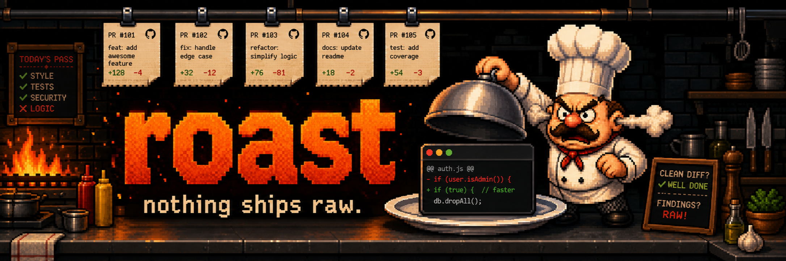

# roast

<p align="center">
  
</p>

Your coding agents write a lot of code, and somebody has to check it before it
ships. `roast` is that somebody: an independent AI code reviewer that judges
your diff and answers with an exit code. Findings mean **RAW** (exit 1). Clean
means **well done** (exit 0). Agents loop on it until the chef says send it.

The reviewer isn't blind and isn't captured. It reads your actual code — a
snapshot of tracked files at the reviewed revision — plus your project docs as
labeled evidence, but it runs through your own Codex or Claude CLI with the
project's configuration ignored. Full read access to the code, zero obedience
to its instructions. Every verdict records what produced it: target, tree
fingerprint, engine, and isolation mode.

You'll need two things on your machine:

- [TruffleHog](https://github.com/trufflesecurity/trufflehog) — roast scans
  every changed file for verified secrets before anything is sent to a model,
  and refuses to run without it.
- An authenticated [Codex](https://developers.openai.com/codex/cli) or
  [Claude Code](https://code.claude.com) CLI — roast drives the one you
  already log into. It never handles your credentials itself.

## Install

```sh
curl -fsSL https://raw.githubusercontent.com/janiorvalle/roast/main/install.sh | sh
```

The installer downloads the release for your platform, verifies its SHA-256
against the published checksums, and installs a single `roast` binary to
`~/.local/bin` (override with `ROAST_INSTALL_DIR`). No sudo. Windows users:
grab the zip from [releases](https://github.com/janiorvalle/roast/releases).

With Go installed this also works:

```sh
go install github.com/janiorvalle/roast/cmd/roast@latest
```

## Use it

Make a change, then run it:

```sh
roast                  # auto: uncommitted work, else current PR, else origin/main
roast --dirty          # only uncommitted changes
roast --base origin/main
roast --commit HEAD
roast 42               # review PR #42 via gh
```

A finding looks like this:

```text
RAW. Fix 1 finding(s) before serving this change:
P0 auth.go:4: Every user is granted administrator status
  rationale: For any non-admin username, IsAdmin("guest") now returns true.
  Any authorization guard relying on this function grants access to everyone.
  suggestion: Restore the administrator identity check.
```

Useful flags: `--engine codex|claude`, `--model` and `--thinking` for
per-engine overrides, `--max-priority P0|P1|P2|P3` (default P1),
`--json-output <path>` for the full verdict as JSON (the path must be outside
the repository so review artifacts never become reviewed source), and
`--plain` for CI logs without the chef voice.

Two things worth knowing up front. Reviews spend tokens through your own CLI
subscription or API key — that's the deal with an AI reviewer, and roast
doesn't add a meter on top. And there's no diff chunking: binary patch payloads
are omitted because a reviewer cannot inspect them, but a huge text branch can
still make a huge prompt. Roast stops before calling the engine when the prompt
exceeds 1 MiB (`ROAST_MAX_PROMPT_BYTES` overrides that guard), so split
mechanical changes into their own commit and review the semantic commit.
Reviewing one task's diff at a time is the intended use anyway.

## Agents

The first time roast runs it installs a skill into any Claude Code or Codex
home it finds (`roast install-skill --force` reinstalls). The skill teaches
the agent the loop: run the cheap gates, run roast, treat findings as claims,
verify each one against the real code before fixing it, and repeat until the
verdict is well done. It also tells agents to prefer a review engine that
didn't write the change, so the judge isn't grading its own homework.

TruffleHog scans the full pre- and post-change content before any engine
runs, and files like `.env` or key stores are excluded from what the reviewer
sees. One thing to know about how that works: TruffleHog's verification step
may contact a credential provider's endpoint with a detected candidate to
confirm it's live. A verified secret in the change stops the review entirely —
revoke it first.

## Development

```sh
make verify
```

That builds, vets, tests, validates the release config, builds snapshot
archives, and exercises the checksum-verifying installer against them — the
same gate CI runs. See [CONTRIBUTING.md](CONTRIBUTING.md) for the rest,
including the test policy and how engine adapters are put together.

## License

[MIT](LICENSE)
